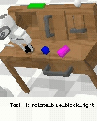

# CALVIN Environment (Python 3.10)

<p align=center>

</p>

The CALVIN environment with updated dependencies. For the original environment + dataset see [here](https://github.com/mees/calvin)

Some of the changes: 
* Removed [tacto](https://github.com/facebookresearch/tacto) dependency. No tactile info such as `rgb_tactile` and `depth_tactile` are available. 
* Updated the dependencies of [urdfpy](https://github.com/NikeHop/urdfpy.git).
* Simplified instantiation of the environment and multistep evaluation.

## Usage 

Install the environment as a dependency via uv or pip. For example using uv:

```sh
uv venv --python=3.10
source .venv/bin/activate
uv pip install git+https://github.com/NikeHop/calvin_env_10.git
```

Create an instance of the environment 

```python
from calvin_env_10.envs.play_table_env import get_env 

task = "task_D" # available tasks: task_A, task_B, task_C

env = get_env(task,show_gui=False)

start_obs = env.reset()

print(start_obs)

done = False
while not done:

  # Relative actions
  action = np.array([0,0,0,0,0,0,1], dtype=np.float32)
  
  # Absolute actions
  #action = (
  #      np.array([0, 0, 0], dtype=np.float32),
  #      np.array([0, 0, 0], dtype=np.float32),
  #      np.array([1], dtype=np.float32),
  #  )
    
  
  obs, reward, done, info = env.step(action)

  print(obs)
  print(reward)
  print(done)
  print(info)

  print("--------------------------------")
  break

```

Structure of the observations:
```sh
{
"rgb_obs": {"rgb_static":np.array,"rgb_gripper":np.array}
"depth_obs": {"depth_static":np.array,"depth_gripper":np.array}
"scene_obs": np.array
"robot_obs": np.array
}
```


Run multistep evaluation by wrapping your policy:

```python
from typing import Any, Union, NewType


import numpy as np

from calvin_env_10.envs.play_table_env import get_env
from calvin_env_10.evaluation.multi_step_evaluation import evaluate_policy

# Type definitions
RelAction = NewType("RelAction", np.ndarray)
AbsAction = NewType("AbsAction", tuple[np.ndarray,np.ndarray,np.ndarray])


class PolicyWrapper():

    def __init__(self, policy):
        self.policy = policy

    def step(
        self, obs: dict[str, np.ndarray], lang_annotation: str
    ) -> list[Union[RelAction, AbsAction]]:
        actions = self.policy(obs, lang_annotation)
        actions = self.transform(actions)
        return actions
    
    def reset(self)->None:
        pass
    
    def transform(self,actions:Any)->list[Union[RelAction, AbsAction]]:
        raise NotImplementedError("Transform your policy output into a list of actions, \
             where the number of actions is the same as the step size")

class BoringPolicy():

    def __call__(self,obs:dict[str,Any],lang_annotation:str)->list[np.ndarray]:
        return [np.array([0,0,0,0,0,0,1],dtype=np.float32) for _ in range(16)]
    
    

class BoringPolicyWrapper(PolicyWrapper):

    def transform(self,actions:Any)->list[np.ndarray]:
        return actions


task = "task_D"  # available tasks: task_A, task_B, task_C
env = get_env(task, show_gui=False)
policy = BoringPolicyWrapper(BoringPolicy())

evaluate_policy(
    policy,
    env,
    step_size=16, # To allow for action chunking
    n_videos=10, # Records the trajectory for the first n sequences
    eval_log_dir="./videos", # Directory to save the videos
    wandb_log=True, # Will log the performance to the calvin_env_10 project 
)
```


## Citation

If you use this environment in your research, please cite the original CALVIN paper:

```bibtex
@article{mees2022calvin,
  title={Calvin: A benchmark for language-conditioned policy learning for long-horizon robot manipulation tasks},
  author={Mees, Oier and Hermann, Lukas and Rosete-Beas, Erick and Burgard, Wolfram},
  journal={IEEE Robotics and Automation Letters},
  volume={7},
  number={3},
  pages={7327--7334},
  year={2022},
  publisher={IEEE}
}
```

## Acknowledgements 

The code is adapted from the repo [calvin_env](https://github.com/mees/calvin_env) published under the MIT license.
